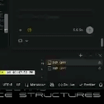
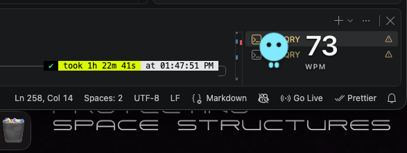
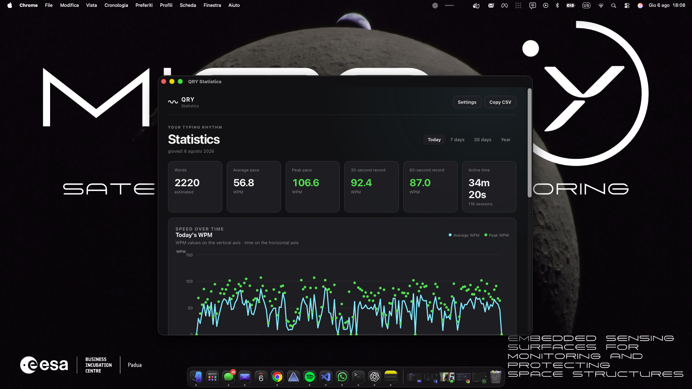
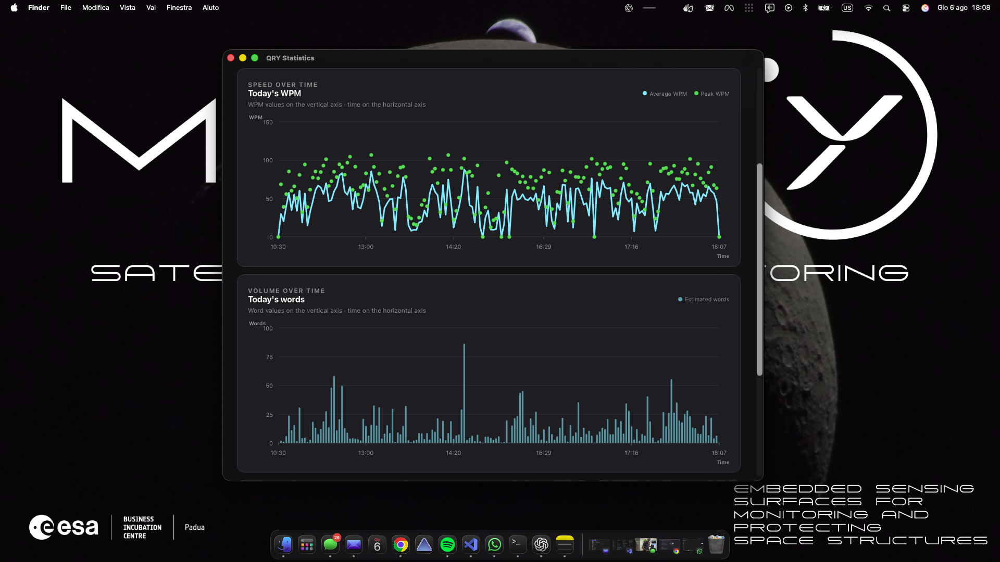

<p align="center">
  <a href="https://qry.micro-y.com">
    
  </a>
</p>

<h1 align="center">QRY</h1>

<p align="center">
  <strong>See your typing rhythm. Not what you type.</strong>
</p>

<p align="center">
  A private, local-first typing rhythm companion for macOS and Windows.<br />
  Live WPM, a responsive desktop companion, and useful statistics—without recording your words.
</p>

<p align="center">
  <a href="https://qry.micro-y.com"><strong>Website</strong></a>
  ·
  <a href="https://github.com/michele-lombardi/QRY/releases">Downloads</a>
  ·
  <a href="docs/privacy.md">Privacy</a>
  ·
  <a href="docs/development.md">Development</a>
</p>

<p align="center">
  <a href="https://github.com/michele-lombardi/QRY/actions/workflows/ci.yml"></a>
  <a href="LICENSE"></a>
  
  
</p>

<p align="center">
  
</p>

---

QRY lives quietly in the macOS menu bar or Windows tray and turns anonymous
typing activity into live feedback. Pip reacts to your pace, the shell can show
your current WPM, and private local statistics help you understand your rhythm
over time.

QRY is intentionally not a keylogger, productivity judge, or cloud analytics
service. It does not need to know which keys you press, what you write, or which
application you use.

## What QRY gives you

| Live rhythm                                                                  | Private statistics                                                           | A quiet desktop presence                                                                |
| ---------------------------------------------------------------------------- | ---------------------------------------------------------------------------- | --------------------------------------------------------------------------------------- |
| Responsive rolling WPM, animation bands, and a stable tray/menu-bar reading. | Today, 7-day, 30-day, and yearly views stored only on your computer.         | A click-through Pip overlay that stays out of the task switcher and never steals focus. |
| Peak, 30-second, and 60-second personal records with one-shot celebrations.  | Estimated words, average and peak WPM, active time, streaks, and CSV export. | Configurable corner, size, content, background, and disappearance delay.                |

### Designed to feel alive, not distracting

- Pip appears only after three accepted typing activities.
- Walk and Run respond to your current pace.
- A new peak, 30-second, or 60-second record triggers a short Jump/Cheer moment.
- When you stop typing, Pip breathes and disappears after your chosen delay.
- With optional Accessibility permission, Pip follows the display containing
  your focused window.
- System Light/Dark appearance and reduced-motion preferences are respected.

## QRY in action

<p align="center">
  <a href="img/qry-pip.png">
    
  </a>
  <br />
  <sub>Pip stays close to your work, reacts to pace, and never takes focus.</sub>
</p>

<table>
  <tr>
    <td width="50%">
      <a href="img/qry-statistics-overview.png">
        
      </a>
    </td>
    <td width="50%">
      <a href="img/qry-statistics-charts.png">
        
      </a>
    </td>
  </tr>
  <tr>
    <td align="center"><sub>Private daily records and aggregate totals</sub></td>
    <td align="center"><sub>Speed and volume shown as separate timelines</sub></td>
  </tr>
</table>

## Privacy is part of the architecture

QRY is built around a strict data boundary:

- individual keys, key codes, words, passwords, and written text are never
  persisted or logged;
- application names, window titles, visited websites, and clipboard contents are
  not collected;
- there are no accounts, telemetry, advertising identifiers, or cloud sync;
- typing activity timestamps are processed transiently and reduced to aggregate
  metrics;
- SQLite stores only session summaries, fixed metric buckets, personal records,
  and preferences;
- optional Accessibility access reads only temporary focused-window geometry for
  display placement—not its title, application, or content;
- data leaves your computer only when you explicitly export it.

The repository includes an automated privacy audit for runtime logging, Tauri
capabilities, public DTOs, and the aggregate-only SQLite schema. Read the full
[privacy model](docs/privacy.md) and [security policy](SECURITY.md).

## First-run experience

1. QRY explains what it measures and what it never collects.
2. On macOS, QRY requests required **Input Monitoring** and optional
   **Accessibility**. If required access is not granted, QRY exits instead of
   pretending to work.
3. Windows needs no equivalent consent, so QRY probes the native monitor without
   displaying a fake permission prompt.
4. You explicitly choose whether QRY should start at login. The default is off.
5. macOS performs the required clean permission restart; Windows starts in the
   same process and moves directly to the tray.

Permission revocation stops monitoring and hides the overlay immediately. QRY
returns to the same guided permission gate without deleting aggregate history.

## Platform capabilities

| Capability      | macOS                     | Windows              | Used for                                                    |
| --------------- | ------------------------- | -------------------- | ----------------------------------------------------------- |
| Global input    | Input Monitoring required | No permission prompt | Counting privacy-safe typing activities for live WPM.       |
| Focused display | Accessibility optional    | No permission prompt | Locating only the display that contains the focused window. |
| Launch at login | Optional                  | Optional             | Opening QRY silently in the tray/menu bar after sign-in.    |

QRY cannot grant or bypass system permissions. Windows does not simulate macOS
consent controls; both platforms keep launch-at-login under the user's control.

## Project status

QRY `0.1.1` is the current public macOS beta line. Windows support implements
the native monitor, permission-free onboarding, tray, focused-display placement,
autostart, local persistence, CI, NSIS/MSI packaging and unified draft-release
automation without forking the product logic.

Before the stable V1, the project is completing its real-device release matrix:
TCC permission flows, logout/login, Gatekeeper/SmartScreen, sleep/wake,
multi-monitor behavior, Windows install/uninstall and final architecture checks.
Release candidates stay draft until those checks are signed off. Initial macOS
artifacts use ad-hoc signing and are not Apple-notarized; initial Windows
artifacts may be unsigned until an Authenticode identity is available.

See the public [roadmap](ROADMAP.md) and [changelog](CHANGELOG.md) for the current
direction and release history.

## Install QRY

### Windows 10/11 x64

Download either `QRY_0.1.1_x64-setup.exe` or
`QRY_0.1.1_x64_en-US.msi` and its matching `.sha256` file from the draft or
published [GitHub Release](https://github.com/michele-lombardi/QRY/releases).
Verify it in PowerShell before running:

```powershell
$asset = "QRY_0.1.1_x64-setup.exe"
$expected = (Get-Content "$asset.sha256").Split()[0].ToLowerInvariant()
$actual = (Get-FileHash $asset -Algorithm SHA256).Hash.ToLowerInvariant()
if ($actual -ne $expected) { throw "QRY checksum mismatch" }
```

The setup executable installs for the current user without requiring admin.
Unsigned development builds can trigger SmartScreen; verify the official URL,
filename and checksum before using **More info → Run anyway**. Never disable
SmartScreen globally.

### macOS beta

QRY targets macOS 10.15 or later.

### Homebrew

Install QRY with its official Homebrew cask:

```bash
brew install --cask michele-lombardi/qry/qry
```

The tap follows the latest public, non-prerelease GitHub Release and refreshes
its version and architecture-specific checksums automatically.

### Manual unsigned installation

1. Download the archive for your architecture and its `.sha256` file from
   [GitHub Releases](https://github.com/michele-lombardi/QRY/releases).
2. Verify the archive, for example:

    ```bash
    shasum -a 256 -c QRY-0.1.1-aarch64.app.zip.sha256
    ```

3. Extract `QRY.app`, move it to `/Applications`, and open it normally.
4. If Gatekeeper blocks the first launch, open **System Settings → Privacy &
   Security**, confirm the warning names QRY, and choose **Open Anyway**.
5. Complete QRY's separate permission onboarding.

Do not disable Gatekeeper globally or remove quarantine recursively from broad
directories. Read the complete [installation guide](docs/installation.md) for
architecture selection, updates, removal, and the unsigned-build trust model.

## Build from source

### Requirements

- macOS with the Apple development SDK / Xcode Command Line Tools, or Windows
  with the MSVC build tools and Windows SDK;
- Rust stable with `rustfmt` and `clippy`;
- Node.js 24 and npm.

### Run QRY locally

```bash
git clone https://github.com/michele-lombardi/QRY.git
cd QRY/QRY
npm ci
npm run tauri dev
```

macOS development builds still require explicit Input Monitoring consent. On
Windows the native monitor starts without a simulated permission prompt.

### Run the complete quality gate

From the repository root:

```bash
./scripts/check.sh
```

The gate checks frontend formatting, ESLint, TypeScript, the Vite build,
Rustfmt, Clippy, all Rust tests, Tauri capability boundaries, the SQLite schema,
and privacy-sensitive DTOs.

## How it is built

```text
macOS event tap / Windows Raw Input
      │
      ▼
privacy filter ── discards key identity
      │
      ▼
TypingActivity(timestamp only)
      │
      ▼
portable Rust engine ── WPM, sessions, records, animation state
      │
      ├──► aggregate-only SQLite storage
      └──► Tauri menu bar, Pip overlay, and statistics UI
```

| Area                                                                  | Responsibility                                                                       |
| --------------------------------------------------------------------- | ------------------------------------------------------------------------------------ |
| [`typepulse-core`](QRY/crates/typepulse-core)                         | Portable WPM, session, record, date, and persistence contracts.                      |
| [`typepulse-platform-desktop`](QRY/crates/typepulse-platform-desktop) | Target-gated desktop permissions, input filtering, and focused-display geometry.     |
| [`typepulse-storage-sqlite`](QRY/crates/typepulse-storage-sqlite)     | Aggregate-only local SQLite adapter and migrations.                                  |
| [`src-tauri`](QRY/src-tauri)                                          | Desktop lifecycle, tray/menu bar, windows, commands, permissions, and orchestration. |
| [`src`](QRY/src)                                                      | Vanilla TypeScript, HTML, and CSS presentation layer.                                |

Start with the [architecture guide](docs/architecture.md),
[decision log](docs/decisions/README.md), and
[development guide](docs/development.md) before changing system boundaries.

## Documentation

- [Product vision](docs/vision.md)
- [Installation guide](docs/installation.md)
- [Privacy model](docs/privacy.md)
- [Architecture](docs/architecture.md)
- [UI guidelines](docs/ui-guidelines.md)
- [Development guide](docs/development.md)
- [Public roadmap](ROADMAP.md)
- [Release process](docs/release-process.md)
- [Architecture decisions](docs/decisions/README.md)

## Contributing

Contributions are welcome. Please read [CONTRIBUTING.md](CONTRIBUTING.md) and the
[Code of Conduct](CODE_OF_CONDUCT.md), keep changes focused, add tests, and run
`./scripts/check.sh` before opening a pull request.

Changes involving global input, permissions, logs, storage, or frontend command
boundaries must explain their privacy impact.

## Security

Please do not disclose sensitive vulnerabilities in public issues. Use
[GitHub private vulnerability reporting](https://github.com/michele-lombardi/QRY/security/advisories/new)
as described in [SECURITY.md](SECURITY.md).

## License

QRY is free software licensed under
[GNU GPL version 3 only](LICENSE) (`GPL-3.0-only`).

Copyright © 2026 Michele Lombardi. See [NOTICE.md](NOTICE.md) for attribution and
project details.

---

<p align="center">
  <a href="https://qry.micro-y.com"><strong>qry.micro-y.com</strong></a>
</p>
