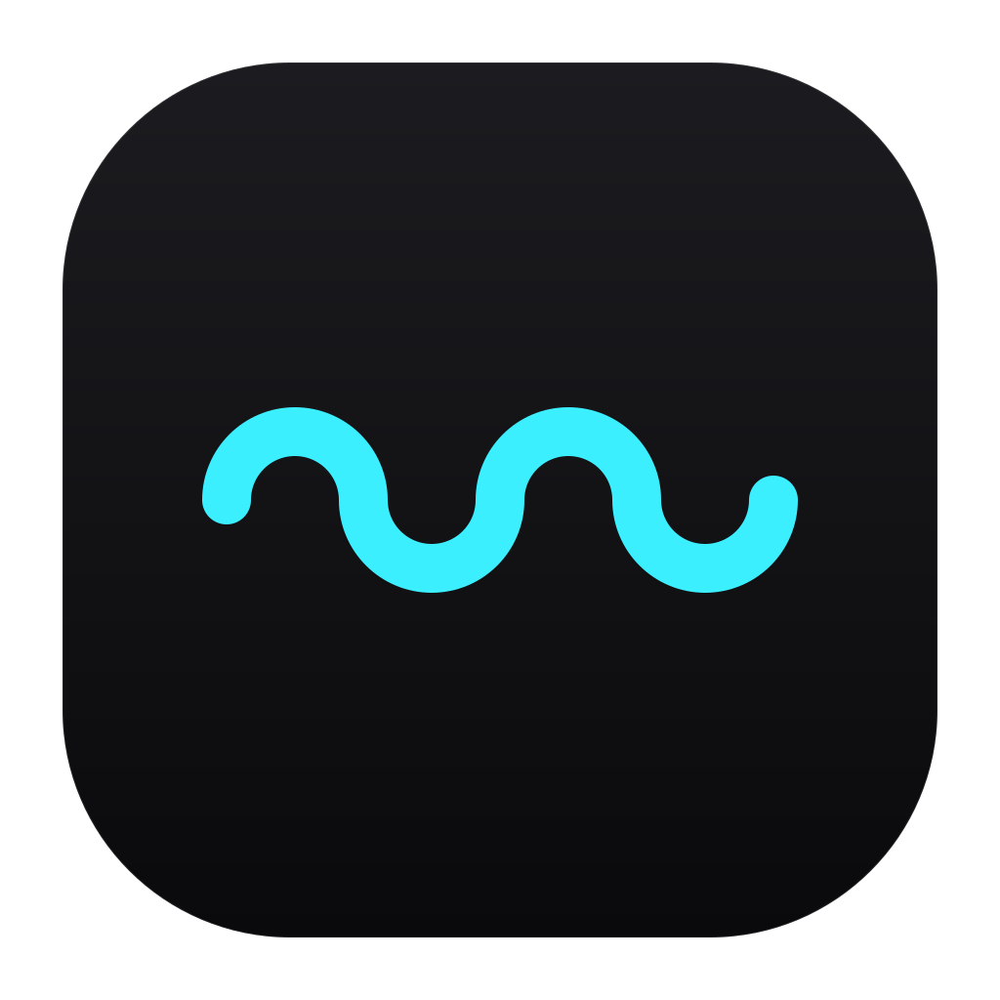

<p align="center">
  <a href="https://qry.micro-y.com">
    
  </a>
</p>

<h1 align="center">QRY</h1>

<p align="center">
  <strong>See your typing rhythm. Not what you type.</strong>
</p>

<p align="center">
  A private, local-first typing rhythm companion for macOS.<br />
  Live WPM, a responsive desktop companion, and useful statistics—without recording your words.
</p>

<p align="center">
  <a href="https://qry.micro-y.com"><strong>Website</strong></a>
  ·
  <a href="https://github.com/michele-lombardi/QRY/releases">Downloads</a>
  ·
  <a href="docs/privacy.md">Privacy</a>
  ·
  <a href="docs/development.md">Development</a>
</p>

<p align="center">
  <a href="https://github.com/michele-lombardi/QRY/actions/workflows/ci.yml"></a>
  <a href="LICENSE"></a>
  
  
</p>

---

QRY lives quietly in the macOS menu bar and turns anonymous typing activity into
live feedback. Pip reacts to your pace, the menu bar can show your current WPM,
and private local statistics help you understand your rhythm over time.

QRY is intentionally not a keylogger, productivity judge, or cloud analytics
service. It does not need to know which keys you press, what you write, or which
application you use.

## What QRY gives you

| Live rhythm                                                                 | Private statistics                                                           | A quiet desktop presence                                                       |
| --------------------------------------------------------------------------- | ---------------------------------------------------------------------------- | ------------------------------------------------------------------------------ |
| Responsive rolling WPM, animation bands, and a stable menu-bar reading.     | Today, 7-day, 30-day, and yearly views stored only on your Mac.              | A click-through Pip overlay that stays out of the Dock and never steals focus. |
| Peak, 30-second, and 60-second personal records with one-shot celebrations. | Estimated words, average and peak WPM, active time, streaks, and CSV export. | Configurable corner, size, content, background, and disappearance delay.       |

### Designed to feel alive, not distracting

- Pip appears only after three accepted typing activities.
- Walk and Run respond to your current pace.
- A new peak, 30-second, or 60-second record triggers a short Jump/Cheer moment.
- When you stop typing, Pip breathes and disappears after your chosen delay.
- With optional Accessibility permission, Pip follows the display containing
  your focused window.
- System Light/Dark appearance and reduced-motion preferences are respected.

## Privacy is part of the architecture

QRY is built around a strict data boundary:

- individual keys, key codes, words, passwords, and written text are never
  persisted or logged;
- application names, window titles, visited websites, and clipboard contents are
  not collected;
- there are no accounts, telemetry, advertising identifiers, or cloud sync;
- typing activity timestamps are processed transiently and reduced to aggregate
  metrics;
- SQLite stores only session summaries, fixed metric buckets, personal records,
  and preferences;
- optional Accessibility access reads only temporary focused-window geometry for
  display placement—not its title, application, or content;
- data leaves your Mac only when you explicitly export it.

The repository includes an automated privacy audit for runtime logging, Tauri
capabilities, public DTOs, and the aggregate-only SQLite schema. Read the full
[privacy model](docs/privacy.md) and [security policy](SECURITY.md).

## First-run experience

1. QRY explains what it measures and what it never collects.
2. macOS asks for **Input Monitoring**, which is required for global typing
   activity. If access is not granted, QRY exits instead of pretending to work.
3. **Accessibility** is offered separately and remains optional. Without it, Pip
   uses the fallback display.
4. You can explicitly choose whether QRY should start at login. The default is
   off, and no login item is created before required permission is valid.
5. QRY performs one clean restart, then runs as a menu-bar accessory.

Permission revocation stops monitoring and hides the overlay immediately. QRY
returns to the same guided permission gate without deleting aggregate history.

## Permissions

| Permission       | Required? | Used for                                                     |
| ---------------- | --------- | ------------------------------------------------------------ |
| Input Monitoring | Yes       | Counting privacy-safe global typing activities for live WPM. |
| Accessibility    | No        | Locating the display that contains the focused window.       |
| Launch at login  | No        | Opening QRY silently in the menu bar after sign-in.          |

QRY cannot grant or bypass macOS permissions. Every choice remains under the
user's control in System Settings.

## Project status

QRY `0.1.0` is the current macOS beta line. The portable metrics engine, macOS
monitor, local persistence, permission onboarding, menu-bar shell, Pip overlay,
settings, statistics, records, and release automation are implemented.

Before the stable V1, the project is completing its real-device release matrix:
TCC permission flows, logout/login, Gatekeeper, sleep/wake, multi-monitor behavior,
and final Apple Silicon/Intel artifact checks. The initial beta artifacts use
ad-hoc signing and are not Apple-notarized.

See the public [roadmap](ROADMAP.md) and [changelog](CHANGELOG.md) for the current
direction and release history.

## Install the macOS beta

QRY targets macOS 10.15 or later.

### Homebrew

The project cask is prepared for the public tap:

```bash
brew tap michele-lombardi/qry
brew install --cask qry
```

The external tap is not public yet, so these commands become available with the
first published tap release. Until then, install the unsigned beta manually.

### Manual unsigned installation

1. Download the archive for your architecture and its `.sha256` file from
   [GitHub Releases](https://github.com/michele-lombardi/QRY/releases).
2. Verify the archive, for example:

    ```bash
    shasum -a 256 -c QRY-0.1.0-aarch64.app.zip.sha256
    ```

3. Extract `QRY.app`, move it to `/Applications`, and open it normally.
4. If Gatekeeper blocks the first launch, open **System Settings → Privacy &
   Security**, confirm the warning names QRY, and choose **Open Anyway**.
5. Complete QRY's separate permission onboarding.

Do not disable Gatekeeper globally or remove quarantine recursively from broad
directories. Read the complete [installation guide](docs/installation.md) for
architecture selection, updates, removal, and the unsigned-build trust model.

## Build from source

### Requirements

- macOS with the Apple development SDK / Xcode Command Line Tools;
- Rust stable with `rustfmt` and `clippy`;
- Node.js 24 and npm.

### Run QRY locally

```bash
git clone https://github.com/michele-lombardi/QRY.git
cd QRY/QRY
npm ci
npm run tauri dev
```

Development builds still require explicit macOS Input Monitoring consent. A
rebuilt unsigned executable may appear to TCC as a new identity.

### Run the complete quality gate

From the repository root:

```bash
./scripts/check.sh
```

The gate checks frontend formatting, ESLint, TypeScript, the Vite build,
Rustfmt, Clippy, all Rust tests, Tauri capability boundaries, the SQLite schema,
and privacy-sensitive DTOs.

## How it is built

```text
macOS event tap
      │
      ▼
privacy filter ── discards key identity
      │
      ▼
TypingActivity(timestamp only)
      │
      ▼
portable Rust engine ── WPM, sessions, records, animation state
      │
      ├──► aggregate-only SQLite storage
      └──► Tauri menu bar, Pip overlay, and statistics UI
```

| Area                                                              | Responsibility                                                                  |
| ----------------------------------------------------------------- | ------------------------------------------------------------------------------- |
| [`typepulse-core`](QRY/crates/typepulse-core)                     | Portable WPM, session, record, date, and persistence contracts.                 |
| [`typepulse-platform-macos`](QRY/crates/typepulse-platform-macos) | macOS permissions, event tap, filtering, and focused-display geometry.          |
| [`typepulse-storage-sqlite`](QRY/crates/typepulse-storage-sqlite) | Aggregate-only local SQLite adapter and migrations.                             |
| [`src-tauri`](QRY/src-tauri)                                      | Desktop lifecycle, menu bar, windows, commands, permissions, and orchestration. |
| [`src`](QRY/src)                                                  | Vanilla TypeScript, HTML, and CSS presentation layer.                           |

Start with the [architecture guide](docs/architecture.md),
[decision log](docs/decisions/README.md), and
[development guide](docs/development.md) before changing system boundaries.

## Documentation

- [Product vision](docs/vision.md)
- [Installation guide](docs/installation.md)
- [Privacy model](docs/privacy.md)
- [Architecture](docs/architecture.md)
- [UI guidelines](docs/ui-guidelines.md)
- [Development guide](docs/development.md)
- [Public roadmap](ROADMAP.md)
- [Release process](docs/release-process.md)
- [Architecture decisions](docs/decisions/README.md)

## Contributing

Contributions are welcome. Please read [CONTRIBUTING.md](CONTRIBUTING.md) and the
[Code of Conduct](CODE_OF_CONDUCT.md), keep changes focused, add tests, and run
`./scripts/check.sh` before opening a pull request.

Changes involving global input, permissions, logs, storage, or frontend command
boundaries must explain their privacy impact.

## Security

Please do not disclose sensitive vulnerabilities in public issues. Use
[GitHub private vulnerability reporting](https://github.com/michele-lombardi/QRY/security/advisories/new)
as described in [SECURITY.md](SECURITY.md).

## License

QRY is free software licensed under
[GNU GPL version 3 only](LICENSE) (`GPL-3.0-only`).

Copyright © 2026 Michele Lombardi. See [NOTICE.md](NOTICE.md) for attribution and
project details.

---

<p align="center">
  <a href="https://qry.micro-y.com"><strong>qry.micro-y.com</strong></a>
</p>
